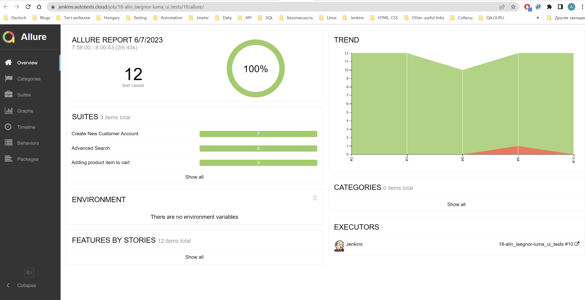
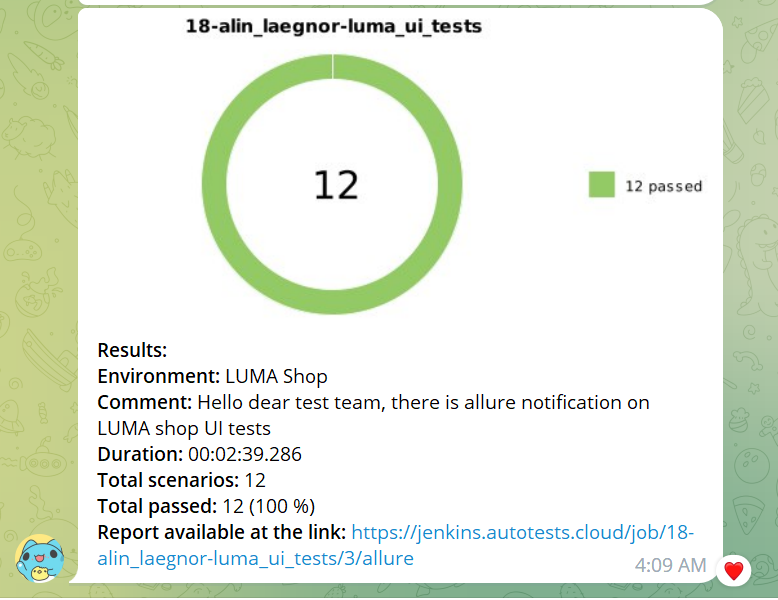

## Automated tests for demo site [Luma](https://magento.softwaretestingboard.com/) – Magento eCommerce

<p>
  
</p>

## Content

- [🛠️ Stack of technologies](#-stack-of-technologies)
- [📄 Description](#-description)
- [📋 List of UI tests](#-list-of-ui-tests)
- [🔌 Running tests from the terminal](#-running-tests-from-the-terminal)
- [🔧 Property files](#-property-files)
- [⚙️ Running tests in Jenkins](#-running-tests-in-jenkins)
- [📊 Test results report in Allure Report](#-test-results-report-in-allure-report)
- [🚀 Integration with Allure TestOps](#-integration-with-allure-testops)
- [🔗 Integration with Jira](#-integration-with-jira)
- [📣 Integration with Telegram](#-telegram-notifications-using-a-bot)
- [📹 Video of running tests](#-test-running-example-in-selenoid)

## 🛠️ Stack of technologies

<div style="text-align: center;">


</div>

## 📄 Description

The test project consists of UI tests and includes the following interesting features:

- ✔️ **Page Object pattern**: Utilizes the `Page Object` pattern for better test organization and maintenance.
- ✔️ **Test data generation**: Test data is generated using the `Faker` library, providing realistic and randomized test
  inputs.
- ✔️ **Parameterized tests**: Employs parameterized tests to efficiently test multiple scenarios with different input
  values.
- ✔️ **Parameterized build**: Supports `parameterized builds` for easily configuring and customizing test runs.
- ✔️ **Configuration files**: Provides `local, remote, and authentication configuration files` with properties for
  seamless test execution in different environments.
- ✔️ **Owner library**: Uses the `Owner` library to handle application configuration through Java properties files,
  ensuring flexibility and ease of configuration management.
- ✔️ **Allure TestOps integration**: Integrates with `Allure TestOps` for comprehensive test reporting and analytics.
- ✔️ **Autotests as test documentation**: The automated tests serve as living documentation, providing up-to

## 📋 List of UI Tests

### Cart Operations

- [x] Add product item to cart with selected size and color
- [x] Add product item to cart without selected options

### Advanced Search

- [x] Check advanced search separately by SKU and Product Name
- [x] Check advanced search by 2 fields at the same time: 'Product Name' and 'SKU'

### Customer Management

- [x] Successful creation of new customer
- [x] Check that fields `firstname`, `lastname`, `email_address`, `password` are required when creating an account

### Password Validation

- [x] Check password validation error messages

## 🔌 Running tests from the terminal

To run tests from the terminal using Gradle, you can use the following commands:

```bash
gradle clean test -Denv='local'
```

When using the `local` environment, the tests will be executed locally on your machine.

```bash
gradle clean test -Denv='remote'
```

When using the `remote` environment, the tests will be executed remotely using Selenide.

By using the `-D` flag followed by the property name (`env` in this case) and its corresponding value (`local`
or `remote`), you can pass system properties to your tests during the Gradle execution. The tests can then access these
properties to determine the execution behavior based on the specified environment.

## 🔧 Property files

Possible properties in `${env}.properties` file:

```properties
browserWithVersion=
baseUrl=
browserSize=
remoteDriverUrl=
```

> - *remoteDriverUrl* - URL for remote WebDriver (Selenoid)
>- *baseUrl* - base URL for UI tests
>- *browserWithVersion* - browser and its version
>- *browserSize* - size of browser

Possible properties in `auth.properties` file:

```properties
usernameSelenoid=
passwordSelenoid=
```

It is needed to adapt auth.properties files locally based on your credentials to remote Selenoid.

##  Running tests in [Jenkins](https://jenkins.autotests.cloud/job/Students/job/18-alin_laegnor-luma_ui_tests/)

To execute the tests in Jenkins, use the following command:

```bash
gradle clean test "-DbrowserWithVersion=${BROWSER_WITH_VERSION}" -DbaseUrl=${BASE_URL} -DbrowserSize=${BROWSER_SIZE} -DremoteDriverUrl=${SELENOID_URL}
```

This command includes various system properties that are used to configure the test execution in Jenkins:

- `-DbrowserWithVersion=${BROWSER_WITH_VERSION}`: Specifies the browser and its version to be used for the test
  execution.
- `-DbaseUrl=${BASE_URL}`: Sets the base URL for the application under test.
- `-DbrowserSize=${BROWSER_SIZE}`: Defines the browser window size.
- `-DremoteDriverUrl=${SELENOID_URL}`: Specifies the URL of the remote WebDriver, such as Selenium Grid or Selenoid.

Make sure to replace `${BROWSER_WITH_VERSION}`, `${BASE_URL}`, `${BROWSER_SIZE}`, and `${SELENOID_URL}` with the
appropriate values based on your Jenkins configuration and test requirements.

Main page of the build:

<div style="text-align: center;">
  
</div>

Job configuration:
<div style="text-align: center;">
  
</div>

##  Test results report in [Allure Report](https://jenkins.autotests.cloud/job/Students/job/18-alin_laegnor-luma_ui_tests/10/allure/)

From <code><strong>Jenkins</strong></code> it is possible to switch to reports generated by <code><strong>
Allure</strong></code>.

<div style="text-align: center;">
  
</div>
<div style="text-align: center;">
  
</div>

##  Integration with [Allure TestOps](https://allure.autotests.cloud/launch/25171)

<div style="text-align: center;">
  
</div>
<div style="text-align: center;">
  
</div>

##  Integration with [Jira](https://jira.autotests.cloud/browse/HOMEWORK-708)

<div style="text-align: center;">
  
</div>

##  Telegram notifications using a bot

After passing all the tests, an automatic report is sent to the <code>Telegram</code> messenger.

<div style="text-align: center;">
    
</div>

##  Test running example in Selenoid

A video is attached to each test in the Allure report.

<div style="text-align: center;">
  
</div>


Moreover, in each test run of the Allure report you can see <code>Browser console logs</code> and <code>Page
source</code>.

[Back to content](#content)
